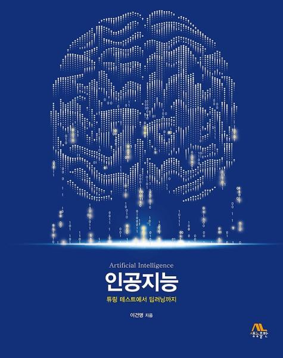

# <b>Artificial_Intelligence_ssu</b>
+ 인공지능 팀프로젝트 8조 
+ 팀원 : [김예훈](https://github.com/gnsdp99), [윤승회](https://github.com/YunSeungHoe), [차영원](https://github.com/YoungwonCha) 
+ Languages 
   
+ 참고 : 튜링 데스트에서 딥러닝까지 인공지능/이건명/생능출판사/2019/제1판2쇄/지정도서 
 
------
## <b> Project 1 </b>
<b> Q. 지능적인 요소가 아직은 없지만 인공지능 기술이 활용되면 서비스 품질이나 기계의 성능이 좋아질 것 같은 사례를 찾아보고, 구체적으로 어떤 인공지능 기술을 활용해야 할지 정리해 보시오.</b> 
+ 인공기능 기술 
  1. AI 로펌
  2. 스마트 미러 
  3. AI 키오스크
------

## <b> Project 2 </b>
<b> Q1. Python programming 1</b> 
- 8퍼즐 문제를 A* 알고리즘으로 해결하는 프로그래밍을 완성하시오. 
- A* 알고리즘을 위해 휴리스틱(heuristic) 함수가 필요하다. 자신만의 휴리스틱 함수를 제시하고 팀원별 프로그래밍을 완성하시오. 
- 팀원별 프로그래밍을 분석한 후 보완 수정 후 최적화된 팀 프로그래밍을 완성하시오. 

<b> Q2. Python programming 2</b> 
- 컴퓨터와 인간이 대결하는 틱택토(tic-tac-toe) 게임을 파이션 언어로 완성하시오. 
- 팀원별 프로그래밍을 완성하고 팀원별 프로그래밍을 분석한 후 보완 수정 후 최적 팀 프로그래밍을 완성하시오. 
------

## <b> Project 3 </b>
<b> 유전자 알고리즘 구현 프로그래밍</b> 
<b> Q1. 8-queen 문제를 유전자 알고리즘으로 해결</b> 

- 유전자 알고맂므으로 8-queen 문제를 풀려면 염색체가 이진 문자열이 아닌 정수들로 이루어진 문자열이어야 한다. 
- 적합도 함수는 서로 공격하지 않는 퀸 쌍의 개수를 사용한다. 만약 모든 퀸들이 서로 공격하지 않는다면 28이다. 
- 여기서 서로 공격하는 퀸 쌍의 개수를 뺀다. 따라서 적합도 함수는 28 - h 가 된다. 
   
<b> Q2. 유전자 알고리즘을 이용하여 9개 도시를 순회하는 TSP를 구현</b> 
- 도시(서울, 인천, 대전, 춘천, 강릉, 대구, 울산, 부산, 광주) 
- 서울에서 출발하여 각 주요 도시는 정확히 한 번 방문해서 서울로 돌아와야 한다. 
- 각 도시를 중복되지 않게 배치되어야 하므로 일반적인 유전자 알고리즘의 유전 연산자의 변경이 필요하다. 
- 적합도 함수를 각각의 도시를 정확히 한 번씩 방문하고 시작점으로 돌아오는 가장 짧은 거리로 정의한다. 
- 참고된 엑셀파일에 주어진 국내 주요도시별 최단 거리를 참고하여 계산한다. 

------